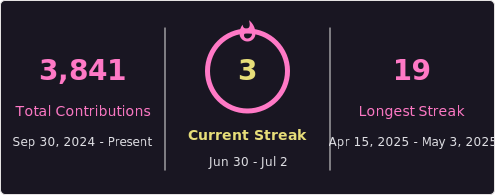

  
  

---

  <h1>Hey, I'm Alrik</h1>
  
I build things: chess engines, ray tracers, logic simulators, shells, and whatever else grabs my attention.

  
3rd year student at Epitech Madrid, working in systems and embedded programming.

---

**Languages**

---

**Projects**

| | |
|---|---|
| [**LogicSim**](https://github.com/alrikn/LogicSim) | Logic gate simulator built from scratch |
| [**RayTracer**](https://github.com/alrikn/RayTracer) | Software ray tracer written in C++ |
| [**minishell**](https://github.com/alrikn/minishell) | Custom Unix shell implementation |
| [**my_sudo**](https://github.com/alrikn/my_sudo) | `sudo` reimplemented in C |

---

**More of my projects**

Here are some of the repos I've built and starred. It's a mix of tools, experiments, and things I'm proud of.

<!-- STARLISTS:START -->

<!-- STARLISTS:END -->

**I write mostly in:**

---

**Activity**

What i've been up to in the last 6 months:

What i've been up to in the last  3 years:

